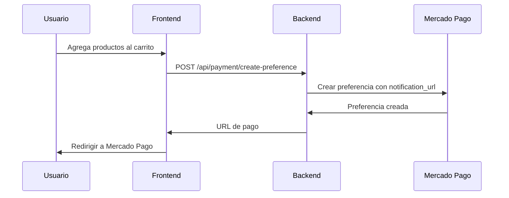
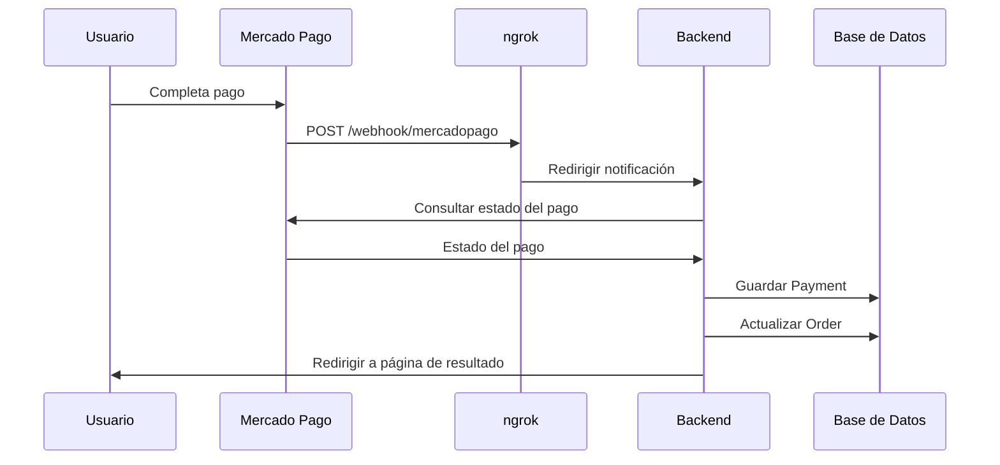
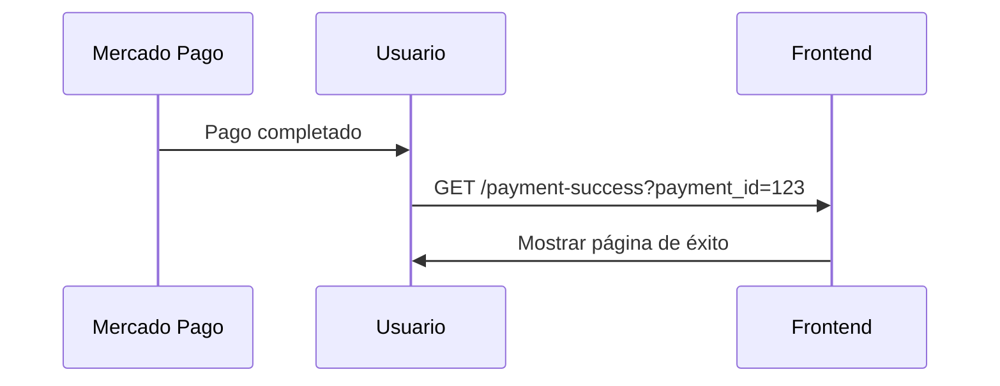

# Implementación Completa: Sistema de Pagos con Base de Datos

## 🎯 **Objetivos Implementados:**

### **1. Guardar Información de Pagos en la DB**
- ✅ **Modelo Payment**: Almacena todos los datos del pago de Mercado Pago
- ✅ **Modelo Order**: Gestiona las órdenes/pedidos de los usuarios
- ✅ **Webhook actualizado**: Guarda automáticamente la información del pago

### **2. Redirección Automática**
- ✅ **Páginas de resultado**: Success, Failure, Pending
- ✅ **URLs configuradas**: El usuario regresa automáticamente a tu app
- ✅ **Mejor UX**: No se queda en la página de Mercado Pago

---

## 🗄️ **Modelos de Base de Datos**

### **Modelo Payment**
```javascript
{
  mp_payment_id: "117072911233",        // ID único de Mercado Pago
  status: "approved",                   // Estado del pago
  amount: 19200,                        // Monto pagado
  currency: "COP",                      // Moneda
  payment_method: {                     // Método de pago
    type: "debit_card",
    id: "visa"
  },
  payer: {                              // Información del pagador
    email: "user@example.com",
    name: "Juan",
    surname: "Pérez"
  },
  external_reference: "HAKO_123456",    // Referencia para vincular con orden
  date_created: "2025-07-06T01:33:45Z", // Fecha de creación
  date_approved: "2025-07-06T01:34:00Z" // Fecha de aprobación
}
```

### **Modelo Order**
```javascript
{
  user: ObjectId,                       // Usuario que hizo la orden
  items: [{                             // Productos en la orden
    product: ObjectId,
    quantity: 4,
    unit_price: 4800,
    total_price: 19200
  }],
  status: "paid",                       // Estado de la orden
  payment: {                            // Información de pago
    mp_payment_id: "117072911233",
    status: "approved",
    method: "debit_card",
    amount: 19200
  },
  external_reference: "HAKO_123456",    // Referencia para Mercado Pago
  total_amount: 19200,                  // Total de la orden
  paid_at: "2025-07-06T01:34:00Z"      // Fecha de pago
}
```

---

## 🔄 **Flujo Completo del Sistema**

### **1. Creación de Preferencia**


### **2. Proceso de Pago**


### **3. Redirección del Usuario**


---

## 📁 **Archivos Creados/Modificados**

### **Backend**
- ✅ **`server/models/Payment.js`** - Modelo para pagos
- ✅ **`server/models/Order.js`** - Modelo para órdenes
- ✅ **`server/controllers/paymentController.js`** - Webhook actualizado

### **Frontend**
- ✅ **`client/src/pages/PaymentSuccessPage.tsx`** - Página de éxito
- ✅ **`client/src/pages/PaymentFailurePage.tsx`** - Página de fallo
- ✅ **`client/src/pages/PaymentPendingPage.tsx`** - Página de pendiente

---

## 🧪 **Cómo Probar**

### **1. Hacer un Pago Real**
1. Ve a tu aplicación
2. Agrega productos al carrito
3. Ve al checkout
4. Completa el pago en Mercado Pago

### **2. Verificar Base de Datos**
```bash
# Conectar a MongoDB
mongosh
use hako

# Ver pagos guardados
db.payments.find().sort({createdAt: -1}).limit(5)

# Ver órdenes actualizadas
db.orders.find().sort({createdAt: -1}).limit(5)
```

### **3. Verificar Logs**
En la consola del backend deberías ver:
```
🔔 Webhook Mercado Pago recibido: { ... }
💳 Estado del pago consultado: approved
💾 Pago guardado en la base de datos
✅ Orden actualizada como pagada: [ID_ORDEN]
```

### **4. Verificar Redirección**
- ✅ Usuario regresa automáticamente a tu aplicación
- ✅ Ve la página de éxito con detalles del pago
- ✅ Puede navegar fácilmente a otras secciones

---

## 🎯 **Beneficios Implementados**

### **1. Historial Completo**
- ✅ **Todos los pagos** quedan registrados en la DB
- ✅ **Información detallada** de cada transacción
- ✅ **Vincular pagos** con órdenes específicas

### **2. Mejor Experiencia de Usuario**
- ✅ **Redirección automática** después del pago
- ✅ **Páginas informativas** según el resultado
- ✅ **Navegación fluida** de vuelta a la aplicación

### **3. Gestión de Órdenes**
- ✅ **Estado automático** de las órdenes
- ✅ **Seguimiento** del proceso de pago
- ✅ **Base para** gestión de inventario y envíos

---

## 🚀 **Próximos Pasos Sugeridos**

### **1. Gestión de Inventario**
```javascript
// Reducir stock cuando el pago sea aprobado
if (paymentInfo.status === 'approved') {
  for (const item of order.items) {
    await Product.updateOne(
      { _id: item.product },
      { $inc: { stock: -item.quantity } }
    );
  }
}
```

### **2. Notificaciones por Email**
```javascript
// Enviar confirmación al usuario
if (paymentInfo.status === 'approved') {
  await sendPaymentConfirmationEmail(paymentInfo.payer.email, order);
}
```

### **3. Panel de Administración**
- Ver todas las órdenes y pagos
- Gestionar estados de envío
- Reportes de ventas

---

## ✅ **Sistema Completo Funcionando**

- ✅ **Webhooks** recibiendo notificaciones
- ✅ **Base de datos** guardando información
- ✅ **Redirección** automática funcionando
- ✅ **Páginas de resultado** informativas
- ✅ **Logs detallados** para depuración

¡Tu sistema de pagos está **100% operativo** y listo para producción! 🎉 