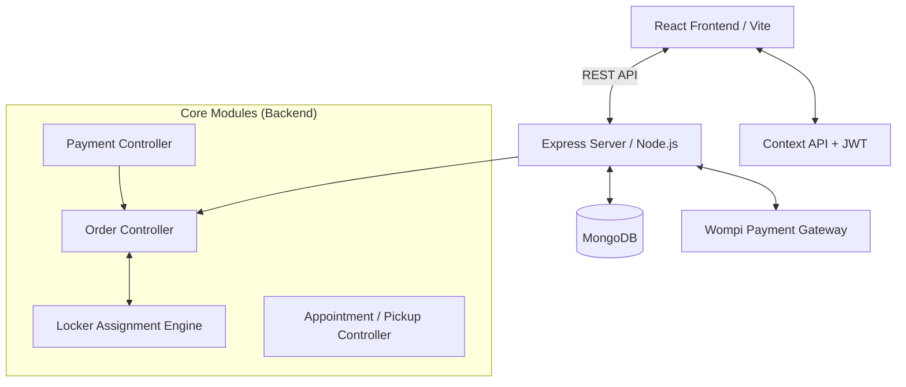
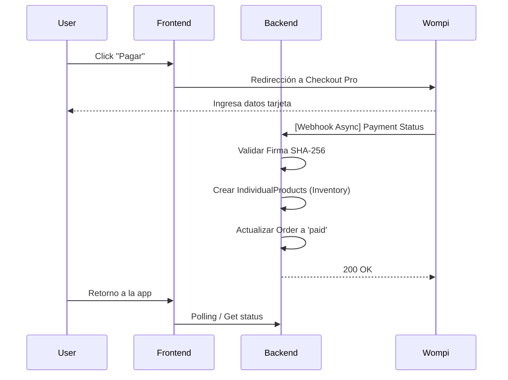

# Hako 📦 - Smart Lockers & E-Commerce Management System

Hako es una plataforma integral Full-Stack diseñada para la gestión automatizada de **Smart Lockers (Casilleros Inteligentes)** vinculados a una tienda de E-Commerce. Permite a los usuarios comprar productos físicos, asignarlos algorítmicamente a casilleros según su volumen (Bin Packing 3D) y programar recolecciones físicas seguras.

---

## 🏗 Arquitectura del Sistema

El sistema utiliza una arquitectura MERN moderna (MongoDB, Express, React, Node.js) tipada con TypeScript en el frontend.



---

## 🛠 Tecnologías Principales

- **Frontend:** React 18, TypeScript, Vite, React Router, Context API, CSS Vanilla (Mobile First).
- **Backend:** Node.js, Express, Mongoose (MongoDB).
- **Pagos:** Integración con **Wompi** (Checkout Pro y Webhooks asíncronos).
- **Notificaciones:** Nodemailer.
- **Seguridad:** JWT (JSON Web Tokens), Bcrypt para encriptación de contraseñas, Idempotencia en pagos.

---

## ⚙️ Implementaciones Complejas y Algoritmos

### 1. Algoritmo de Asignación de Casilleros (Bin Packing 3D)
El sistema asigna productos automáticamente a los casilleros disponibles calculando el volumen. Evita saturación y permite optimizar el espacio usando un enfoque de **Bin Packing 3D**.
- **Cálculo de Volumen:** `Largo x Ancho x Alto`.
- **Lógica:** Cuando un usuario realiza un pago o agenda una recogida, el sistema evalúa los productos comprados y los introduce en un casillero virtual verificando si el volumen total excede la capacidad máxima del casillero físico.
- **Manejo de Variantes:** La lógica dimensional es capaz de leer las dimensiones específicas de la variante seleccionada, no solo del producto base.

### 2. Flujo de Pagos Resiliente (Webhook con Idempotencia)
Para evitar pagos duplicados o pérdida de datos por fallas de red:
1. El frontend genera un `reference_id` único y llama a Wompi.
2. Wompi procesa el pago y llama al Webhook expuesto en el servidor de Hako.
3. El webhook valida la firma **SHA-256** del payload.
4. **Operación Atómica:** El sistema asegura la creación física en la base de datos de los ítems (`IndividualProduct`) *antes* de marcar la orden como pagada.



### 3. Ciclo de Vida del Inventario y Reservas
El sistema no borra productos cuando el administrador cancela una orden, utiliza un sistema de estados estricto para evitar pérdidas (Data Leaks de inventario).

**Estados del `IndividualProduct`:**
- `available`: En bodega, listo para ser reservado.
- `reserved`: Asignado por el sistema/admin a un locker.
- `claimed`: En un locker, esperando a ser recogido por el usuario en una cita (Appointment).
- `picked_up`: Retirado físicamente del casillero.

---

## 🗄️ Modelado de Datos Core

### `User`
Maneja autenticación y auditoría. Cuenta con un mecanismo de **Soft-Delete** (`isActive: boolean`, `deactivatedAt: Date`) para mantener integridad relacional de los pagos históricos si un usuario es borrado por el administrador.

### `Order`
Registra la compra maestra. Se enlaza con el E-commerce. Contiene detalles transaccionales (`wompi_transaction_id`).

### `IndividualProduct`
**El corazón del E-commerce**. Por cada `item` en una `Order`, se generan N `IndividualProducts`. Esto permite rastrear físicamente *cada caja* individualmente, permitiendo que un usuario compre 5 shampoos pero retire solo 2 hoy y 3 mañana en diferentes casilleros.

### `Appointment`
Gestiona las "Citas" de recolección. Vincula uno o más `IndividualProducts` con un casillero específico y un horario (`timeSlot`).

---

## 🛡️ Seguridad y Buenas Prácticas
1. **Middlewares Estrictos:** `auth` para usuarios y `adminAuth` para operaciones destructivas o de lectura global.
2. **Sanitización (Whitelist):** Los endpoints de actualización de estados de órdenes y pagos rechazan cualquier valor que no esté en la lista permitida.
3. **No-Delete Financiero:** No se puede borrar un pago (`deletePayment`) si existe una orden activa asociada al mismo.
4. **Control de Errores Silenciosos:** Los logs masivos están protegidos por una variable de entorno `isDev` para no saturar los contenedores en Producción.

---

## 🚀 Despliegue (Deployment)

1. Compilar el cliente Vite:
   ```bash
   cd client
   npm run build
   ```
2. Iniciar el servidor (Production Mode):
   ```bash
   export NODE_ENV=production
   node server.js
   ```

## 🧑‍💻 Autor y Mantenimiento
Proyecto mantenido bajo altos estándares de DevSecOps, enfocado al E-commerce físico y experiencia de usuario Mobile-First.
