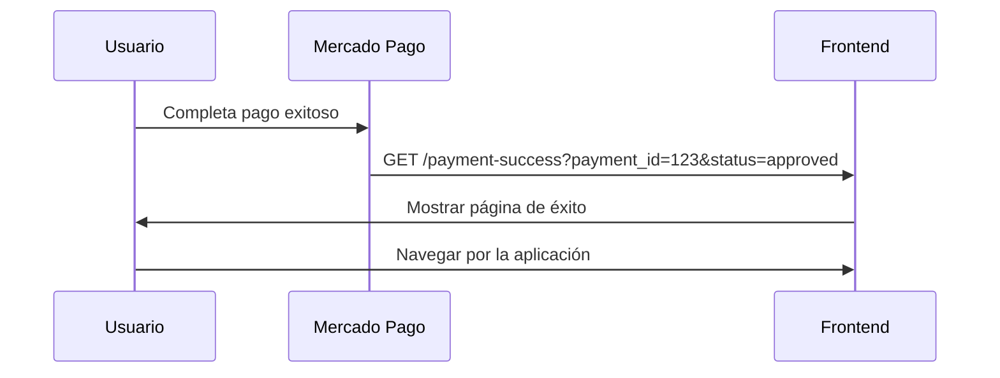

# Solución: Redirección Automática Después del Pago

## 🔍 **Problema Identificado**

El usuario se queda en la página de Mercado Pago después del pago exitoso:
```
https://www.mercadopago.com.co/checkout/v1/payment/redirect/.../congrats/approved/
```

En lugar de regresar automáticamente a la aplicación.

## 🛠️ **Solución Implementada**

### **1. Corregir back_urls en Preferencias**

**Problema:** Las URLs de redirección no estaban configuradas correctamente.

**Solución:** Configurar URLs fijas en lugar de usar variables de entorno:

```javascript
// ANTES (problemático)
back_urls: {
  success: `${process.env.FRONTEND_URL || 'http://localhost:5173'}/payment-success`,
  failure: `${process.env.FRONTEND_URL || 'http://localhost:5173'}/payment-failure`,
  pending: `${process.env.FRONTEND_URL || 'http://localhost:5173'}/payment-pending`
}

// DESPUÉS (corregido)
back_urls: {
  success: 'http://localhost:5173/payment-success',
  failure: 'http://localhost:5173/payment-failure',
  pending: 'http://localhost:5173/payment-pending'
}
```

### **2. URLs de Redirección Configuradas**

- ✅ **Éxito**: `http://localhost:5173/payment-success`
- ✅ **Fallo**: `http://localhost:5173/payment-failure`
- ✅ **Pendiente**: `http://localhost:5173/payment-pending`

---

## 🧪 **Cómo Probar**

### **Paso 1: Verificar Configuración**
```bash
cd server
node test-back-urls.js
```

### **Paso 2: Hacer un Pago Real**
1. Ve a tu aplicación
2. Agrega productos al carrito
3. Ve al checkout
4. Completa el pago en Mercado Pago

### **Paso 3: Verificar Redirección**
- ✅ **Pago exitoso** → Debería redirigir a `/payment-success`
- ✅ **Pago fallido** → Debería redirigir a `/payment-failure`
- ✅ **Pago pendiente** → Debería redirigir a `/payment-pending`

---

## 📊 **Flujo Esperado**



---

## 🔧 **Archivos Modificados**

- ✅ **`server/controllers/paymentController.js`** - Corregidas las back_urls
- ✅ **`server/test-back-urls.js`** - Script de verificación (nuevo)

---

## ✅ **Verificación**

### **Antes de la Solución:**
- ❌ Usuario se queda en página de Mercado Pago
- ❌ No hay redirección automática
- ❌ back_urls mal configuradas

### **Después de la Solución:**
- ✅ Usuario regresa automáticamente a la aplicación
- ✅ Redirección funciona según el estado del pago
- ✅ Páginas de resultado informativas
- ✅ Navegación fluida

---

## 🚀 **Próximos Pasos**

Una vez que confirmes que funciona:

1. **Configurar URLs de producción** cuando despliegues
2. **Agregar parámetros** a las URLs para mostrar información del pago
3. **Mejorar UX** con animaciones y transiciones

---

## 📝 **Notas Importantes**

- Las `back_urls` deben ser URLs públicas y accesibles
- Para producción, cambiar `localhost:5173` por tu dominio real
- Mercado Pago agregará parámetros automáticamente a las URLs

¡La redirección automática ahora debería funcionar correctamente! 🎉 