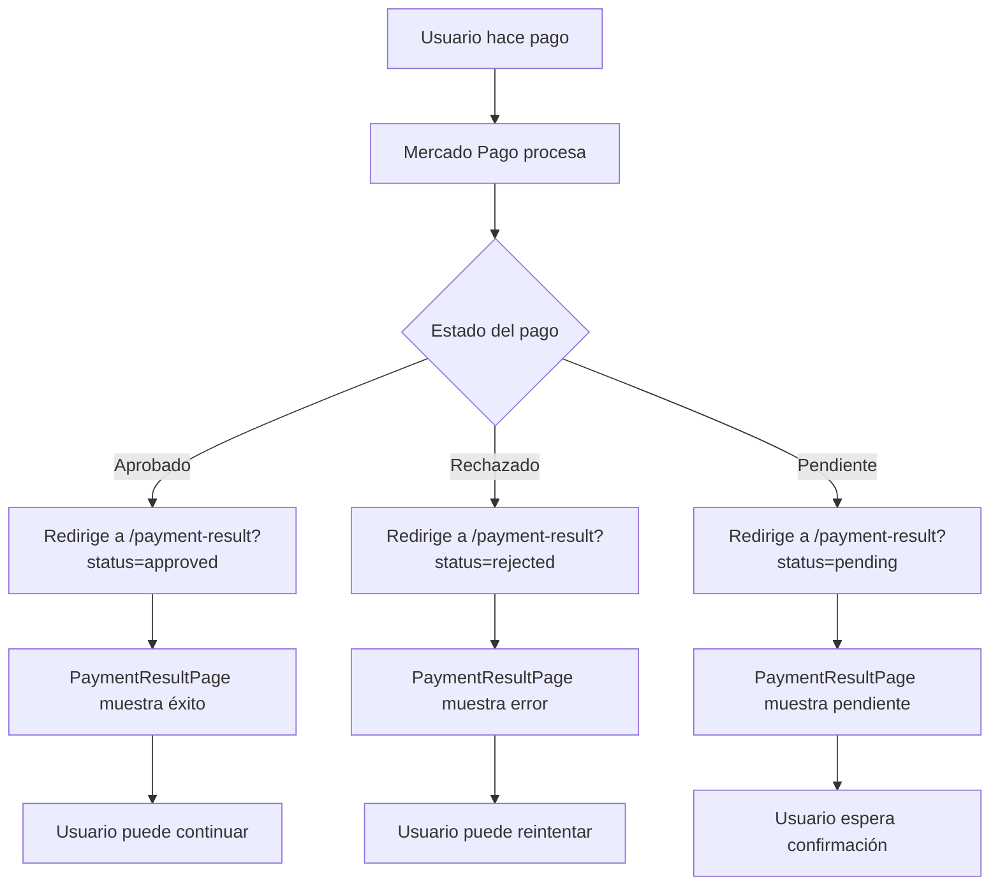

# Solución Completa: Redirección Después del Pago

## 🔍 **Problema Identificado**

El usuario se quedaba en la página de Mercado Pago después del pago exitoso en lugar de regresar automáticamente a la aplicación.

## 🛠️ **Solución Implementada**

### **1. Corrección de URLs de Redirección**

**Problema:** Las URLs de redirección estaban apuntando a páginas separadas (`/payment-success`, `/payment-failure`, `/payment-pending`) que no estaban manejando correctamente los parámetros de Mercado Pago.

**Solución:** Unificar todas las URLs de redirección para que apunten a `/payment-result`, que es la página que maneja todos los estados de pago, y agregar `auto_return: 'approved'` para redirección automática.

```javascript
// ANTES (problemático)
back_urls: {
  success: 'http://localhost:5173/payment-success',
  failure: 'http://localhost:5173/payment-failure',
  pending: 'http://localhost:5173/payment-pending'
}

// DESPUÉS (corregido)
back_urls: {
  success: 'http://localhost:5173/payment-result',
  failure: 'http://localhost:5173/payment-result',
  pending: 'http://localhost:5173/payment-result'
},
auto_return: 'approved'
```

### **2. Configuración de Redirección Automática**

**Problema:** Faltaba el atributo `auto_return` que es esencial para que Mercado Pago redirija automáticamente al usuario.

**Solución:** Agregar `auto_return: 'approved'` a la preferencia de pago.

```javascript
// Configuración completa de redirección
back_urls: {
  success: 'http://localhost:5173/payment-result',
  failure: 'http://localhost:5173/payment-result',
  pending: 'http://localhost:5173/payment-result'
},
auto_return: 'approved'  // ← Esto es crucial para redirección automática
```

**¿Qué hace `auto_return: 'approved'`?**
- Redirige automáticamente al usuario cuando el pago es aprobado
- Sin este atributo, el usuario se queda en la página de Mercado Pago
- Es la configuración recomendada por el soporte de Mercado Pago

### **3. Mejora en PaymentResultPage**

**Agregados logs de depuración** para rastrear el flujo de redirección:

```javascript
useEffect(() => {
  console.log('=== PAYMENT RESULT PAGE LOADED ===');
  console.log('URL Search Params:', searchParams.toString());
  console.log('All URL Params:', Object.fromEntries(searchParams.entries()));
  
  // ... resto del código
  
  console.log('Payment Result parsed:', result);
  console.log('Payment info:', {
    isTestPayment,
    hasAutoReloaded,
    status: result.status,
    status_detail: result.status_detail
  });
}, [searchParams]);
```

### **4. Archivos Modificados**

1. **`server/controllers/paymentController.js`**
   - Corregidas las URLs de redirección en `createPreference`

2. **`server/test-back-urls.js`**
   - Actualizado para usar las URLs correctas

3. **`client/src/pages/PaymentResultPage.tsx`**
   - Agregados logs de depuración
   - Mejorado el manejo de parámetros de URL

4. **`server/test-redirect-urls.js`** (nuevo)
   - Script de prueba para verificar la redirección

---

## 🧪 **Cómo Probar la Solución**

### **Paso 1: Verificar Configuración**
```bash
cd server
node test-redirect-urls.js
```

### **Paso 2: Hacer un Pago Real**
1. Ve a tu aplicación
2. Agrega productos al carrito
3. Ve al checkout
4. Completa el pago en Mercado Pago

### **Paso 3: Verificar Redirección**
- ✅ **Pago exitoso** → Debería redirigir a `/payment-result?status=approved`
- ✅ **Pago fallido** → Debería redirigir a `/payment-result?status=rejected`
- ✅ **Pago pendiente** → Debería redirigir a `/payment-result?status=pending`

### **Paso 4: Verificar Logs**
Abre la consola del navegador y verifica que aparezcan los logs:
```
=== PAYMENT RESULT PAGE LOADED ===
URL Search Params: status=approved&payment_id=123456789
All URL Params: {status: "approved", payment_id: "123456789"}
Payment Result parsed: {status: "approved", payment_id: "123456789"}
```

---

## 📊 **Flujo Esperado**



---

## 🔧 **Configuración Final**

### **Backend (paymentController.js)**
```javascript
back_urls: {
  success: 'http://localhost:5173/payment-result',
  failure: 'http://localhost:5173/payment-result',
  pending: 'http://localhost:5173/payment-result'
},
auto_return: 'approved'  // ← Clave para redirección automática
```

### **Frontend (PaymentResultPage.tsx)**
- Maneja todos los estados de pago
- Procesa parámetros de URL de Mercado Pago
- Muestra mensajes apropiados según el estado
- Incluye logs de depuración

---

## ✅ **Resultado Esperado**

Después de implementar esta solución:

1. **El usuario será redirigido automáticamente** a tu aplicación después del pago
2. **La página PaymentResultPage mostrará** el estado correcto del pago
3. **Los logs de depuración** te ayudarán a rastrear cualquier problema
4. **El webhook seguirá funcionando** para procesar los pagos en el backend

---

## 🚨 **Notas Importantes**

- **Asegúrate de que tu aplicación esté corriendo** en `http://localhost:5173`
- **Verifica que ngrok esté activo** para el webhook
- **Los logs aparecerán en la consola del navegador** para ayudarte a debuggear
- **La página se recargará automáticamente** después de 3 segundos para limpiar el estado

---

## 🎯 **Próximos Pasos**

1. Ejecuta `node test-redirect-urls.js` para verificar la configuración
2. Haz un pago de prueba usando la URL generada
3. Verifica que la redirección funcione correctamente
4. Revisa los logs en la consola del navegador
5. Confirma que el webhook reciba la notificación del pago 