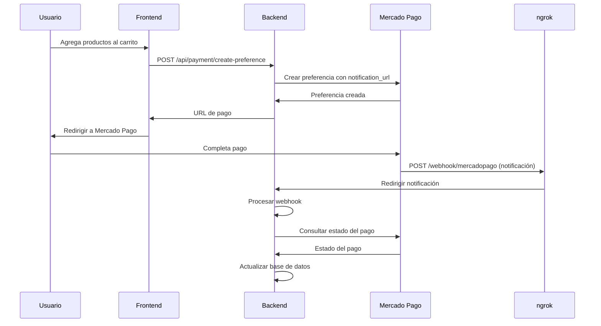

# Solución: Webhook para Pagos Reales

## 🔍 **Problema Identificado**

El webhook funcionaba para **simulaciones** pero no para **pagos reales** porque:
- ❌ **notification_url** estaba hardcodeada como `'https://webhook.site/your-unique-url'`
- ❌ Mercado Pago no sabía dónde enviar las notificaciones de pagos reales

## 🛠️ **Solución Implementada**

### **1. Configurar notification_url en Preferencias**

Cambiamos la URL del webhook en la creación de preferencias:

```javascript
// ANTES
notification_url: 'https://webhook.site/your-unique-url',

// DESPUÉS  
notification_url: 'https://e6c7-190-24-30-135.ngrok-free.app/api/payment/webhook/mercadopago',
```

### **2. Archivos Modificados**

- ✅ **`server/controllers/paymentController.js`**
  - Línea 53: `createPreference()` - Función principal
  - Línea 207: `testConfig()` - Función de prueba

### **3. URL del Webhook Configurada**

```
https://e6c7-190-24-30-135.ngrok-free.app/api/payment/webhook/mercadopago
```

## 🧪 **Cómo Probar**

### **Paso 1: Verificar Configuración**
```bash
cd server
node test-webhook-url.js
```

### **Paso 2: Hacer un Pago Real**
1. Ve a tu aplicación
2. Agrega productos al carrito
3. Ve al checkout
4. Haz clic en "Pagar con Mercado Pago"
5. Completa el pago en Mercado Pago

### **Paso 3: Verificar Webhook**
- Observa la consola de tu backend
- Deberías ver logs como:
```
🔔 Webhook Mercado Pago recibido: { ... }
📋 Datos del webhook:
  - Payment ID: [ID_REAL]
  - Topic: payment
🔍 Consultando pago en Mercado Pago: https://api.mercadopago.com/v1/payments/[ID_REAL]
💳 Estado del pago consultado: approved
✅ Webhook procesado correctamente
```

### **Paso 4: Verificar ngrok**
En la terminal de ngrok deberías ver:
```
Connections                   ttl     opn     rt1     rt5     p50     p90
1                            1       0       0.00    0.00    0.00    0.00
```

## 📊 **Flujo Completo**



## ✅ **Verificación**

### **Antes de la Solución:**
- ❌ Webhook solo funcionaba en simulaciones
- ❌ No llegaban notificaciones de pagos reales
- ❌ notification_url incorrecta

### **Después de la Solución:**
- ✅ Webhook funciona con pagos reales
- ✅ notification_url configurada correctamente
- ✅ Notificaciones llegan al backend
- ✅ Logs detallados funcionando

## 🚀 **Próximos Pasos**

Una vez que confirmes que funciona:

1. **Actualizar base de datos** según el estado del pago
2. **Enviar notificaciones** al usuario
3. **Actualizar inventario** si es necesario
4. **Registrar transacciones** en logs

## 🔧 **Comandos Útiles**

### **Verificar configuración:**
```bash
node test-webhook-url.js
```

### **Monitorear ngrok:**
```bash
ngrok http 5000
```

### **Ver logs del backend:**
```bash
npm run dev
```

¡Ahora los webhooks deberían funcionar con pagos reales! 🎉 